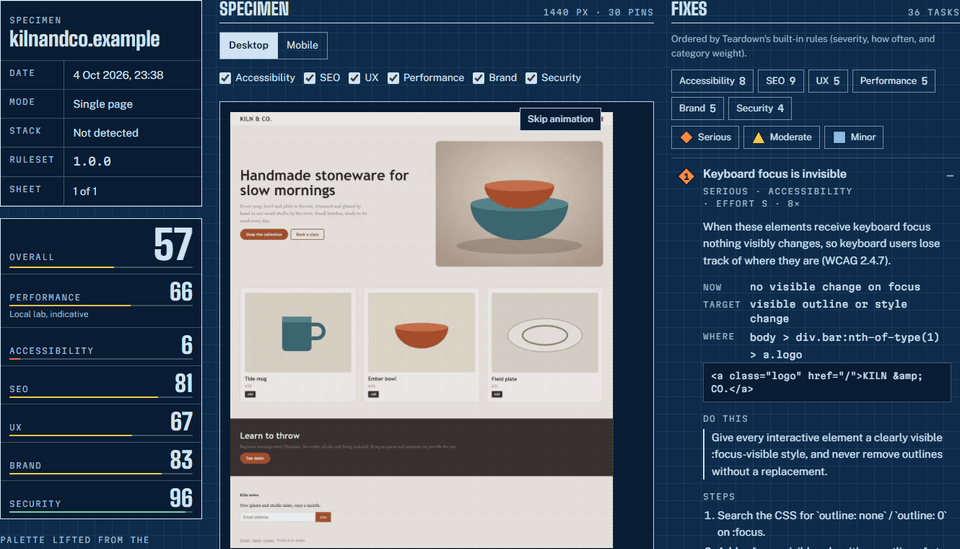
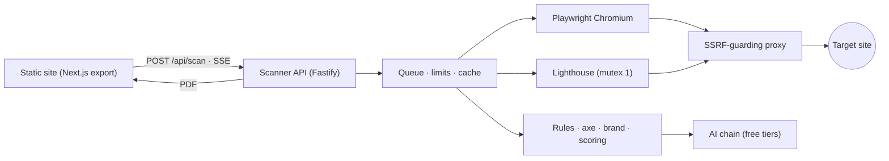

# Teardown

[](https://github.com/KrishAryan12/Teardown/actions/workflows/ci.yml)
[](LICENSE)

**Paste a URL. Teardown takes the site apart in a real browser and hands back a prioritised fix list, its brand system, and a brief your AI coding agent can execute.**



**Live demo:** _add your Vercel URL here after deploying_ · **[Sample report](apps/web/public/sample/report.json)** · Free, no account, nothing stored.

## What you get

| Export | For | What's in it |
|---|---|---|
| **PDF report** | People | A drawing set of the site: title block, score readouts, the screenshot annotated with numbered pins, the brand sheet (palette, type specimens, spacing ruler, radii, failing contrast pairs) and every fix with acceptance criteria. |
| **Agent brief** (`.md`) | AI coding agents | Tasks in priority order, each with where, what's wrong, current → target, steps, acceptance criteria and a verification step, plus the brand as a ready-to-paste `:root` token block. |
| **JSON** | Machines | The full versioned report (`teardown.report/v1`, [JSON Schema](apps/web/public/schema/report-v1.json)) with design tokens. Optional "without images" variant. |

## How it works

1. **A real browser.** Headless Chromium loads the page at desktop (1440 px) and phone (390 px) sizes, scrolls it to trigger lazy content, waits for fonts and reads the styles it actually rendered.
2. **Rules, not guesses.** 65 deterministic checks for SEO, accessibility (plus axe-core), UX, security hygiene, brand consistency and page weight. Each comes with a fix template and testable acceptance criteria ([docs/RULES.md](docs/RULES.md)).
3. **Performance.** Lighthouse runs inside the scanner (mobile, simulated throttling). PageSpeed Insights is used instead if you add a key. If neither can run, an estimate is shown and labelled as one.
4. **The brand system.** Colours are clustered in CIELAB (CIEDE2000) and given roles. Fonts are matched to the face Chromium actually rendered. The type scale, spacing grid, radii, shadows, `:root` tokens and every text/background contrast pair are extracted.
5. **Prioritised by a small AI model, safely.** A free-tier model (Gemini Flash-Lite, Groq Llama 8B, HF or OpenRouter free) orders the issue groups and writes the top 10 instructions. It can't add, remove or re-grade findings. Its output is validated, page text is treated as untrusted data, and if the model is unavailable the built-in order and fix text are used.

## Architecture



Monorepo: `packages/core` (zod schemas, scoring, exporters: the shared contract), `apps/scanner` (Fastify + Playwright, Docker on a HuggingFace Space), `apps/web` (Next.js static export on Vercel or any static host). Details in [docs/ARCHITECTURE.md](docs/ARCHITECTURE.md).

**Stack:** TypeScript, Node 22+, Fastify 5, Playwright 1.63, Lighthouse 13, axe-core 4, sharp, zod 4, Next.js 16, React 19, Vitest, pnpm workspaces.

## Using the agent brief

Copy the brief from the report ("Copy agent brief") and paste it into Claude Code, Cursor, Copilot or any coding agent working in the site's repository:

> Here is a Teardown brief for our site. Work through the tasks in order, one at a time. After each task, run its verification step and tell me the result before moving on.

The brief tells the agent to make the smallest change that meets each task's acceptance criteria, to reuse the extracted brand tokens instead of inventing new colours or fonts, and to treat quoted page text as data rather than instructions. Re-run Teardown afterwards: finding ids are stable, so fixed tasks disappear.

## Security and limits

- **SSRF protection:** every URL, redirect hop and browser request is validated. DNS is resolved by the scanner, and private, loopback, link-local (incl. cloud metadata), CGNAT, reserved and IPv4-mapped addresses are refused. Only ports 80 and 443 are allowed. All Chromium traffic, Lighthouse's included, goes through a local proxy that connects only to validated IPs, which closes DNS rebinding. See [docs/SECURITY.md](docs/SECURITY.md).
- **Ethical scanning:** identifies as `TeardownBot` with a contact URL, follows robots.txt in full-site mode, and never gets past logins, paywalls or bot protection.
- **Limits** (all configurable): 5 single-page scans per hour and 15 per day per IP, 1 full-site scan (up to 15 pages) per day, 10 scans per target domain per day, 2 scans at a time with a queue of 15, and 10 PDF exports per hour.
- **Nothing stored:** reports live in your browser tab and the files you download. The scanner keeps an in-memory cache for 6 hours and logs only the hostname, mode, outcome and duration.

## Local development

Requires Node 22.19+ and pnpm.

```bash
pnpm install
pnpm --filter @teardown/scanner exec playwright install chromium
cp .env.example .env            # add AI keys if you have them (optional)

# Scanner on :7860. ALLOW_PRIVATE_TARGETS lets it scan local fixtures; never in production.
ALLOW_PRIVATE_TARGETS=true pnpm --filter @teardown/scanner dev
# Website on :3000
pnpm --filter @teardown/web dev
```

| Command | What it does |
|---|---|
| `pnpm check` | Typecheck, lint and unit tests |
| `pnpm test:integration` | Real Chromium: SSRF proxy, capture, full fixture scan, full-site scan, PDF |
| `pnpm ai:eval` | Scores every configured AI provider/model on fixture findings |
| `pnpm sample:generate` | Rebuilds the landing-page sample report from `fixtures/pages/sample` |
| `pnpm --filter @teardown/scanner exec tsx scripts/scan.ts <url> [--site]` | Run a scan from the command line |
| `pnpm health [scanner-url]` | Health check, quota and SSRF refusal smoke test |
| `pnpm --filter @teardown/web test:a11y` | axe and keyboard checks on the built site |

Deployment: [docs/DEPLOY.md](docs/DEPLOY.md). Decisions and verified free-tier facts: [docs/DECISIONS.md](docs/DECISIONS.md). Design: [docs/DESIGN.md](docs/DESIGN.md).

## Ideas

- Shared rate limits with the Upstash Redis free tier (the `RateStore` interface is ready)
- Authenticated scans for pages behind a login (opt-in, owner-verified)
- Comparing two scans of the same site (finding ids are stable)
- PageSpeed Insights field data (CrUX) alongside lab numbers

## License

[MIT](LICENSE)
