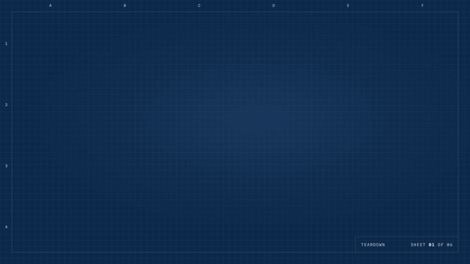
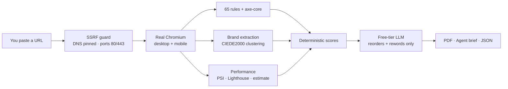

<div align="center">



# Teardown

**Take any website apart.**

Paste a URL. Teardown loads it in a real browser and hands back a prioritised fix list, the site's brand system, and a brief your AI coding agent can execute.

[](https://github.com/KrishAryan12/Teardown/actions/workflows/ci.yml)
[](LICENSE)


[**Try it live**](https://teardown-lab.vercel.app) · [**Sample report**](https://teardown-lab.vercel.app/sample) · [**Watch the video (MP4)**](docs/launch.mp4) · [**Deploy your own**](#deploy-your-own) · [**How it works**](#how-it-works)

</div>

---

## Why Teardown

Most site audits give you a score and a wall of warnings. Teardown gives you a **drawing set**: the page as a specimen with every problem pinned and numbered, the design system it actually ships, and a fix list written so that a person *or* an agent can work through it.

- **Real rendering, not HTML parsing.** Headless Chromium at desktop (1440 px) and phone (390 px) sizes, with lazy content scrolled in and fonts loaded.
- **65 deterministic rules plus axe-core.** SEO, accessibility, UX, security hygiene, brand consistency and page weight. Each rule comes with a fix template and testable acceptance criteria.
- **The brand system, extracted.** A clustered palette with roles, rendered fonts, type scale, spacing grid, radii, shadows, `:root` tokens and every failing contrast pair.
- **Written for agents.** The Markdown brief lists tasks in priority order. Each task has location, current → target, steps, acceptance criteria and a verification step.
- **Free, private, no account.** It runs entirely on free tiers. Reports live in your browser tab, not in a database.

## What you get

<table>
<tr>
<td width="33%" valign="top">

### 📄 PDF report
**For people.** A title block, score readouts, the screenshot annotated with severity-shaped pins, the brand sheet, and every fix with acceptance criteria.

</td>
<td width="33%" valign="top">

### 🤖 Agent brief
**For coding agents.** Prioritised Markdown tasks with where / what / current → target / steps / verification, plus the brand as a ready-to-paste `:root` token block.

</td>
<td width="33%" valign="top">

### 🧾 JSON
**For machines.** The full versioned report (`teardown.report/v1`) with a [JSON Schema](apps/web/public/schema/report-v1.json) and design tokens. There's also a variant without images.

</td>
</tr>
</table>

<details>
<summary><b>What an agent-brief task looks like</b></summary>

```markdown
### T1. Keyboard focus is invisible  [serious | accessibility | effort s]
- **Where:** https://kilnandco.example/ · `body > div.bar:nth-of-type(1) > a.logo` (8 instances)
- **Problem:** When these elements receive keyboard focus nothing visibly changes, so keyboard users lose track of where they are (WCAG 2.4.7).
- **Current → target:** no visible change on focus → visible outline or style change
- **Do this:** Give every interactive element a clearly visible :focus-visible style, and never remove outlines without a replacement.
- **Code hint:**

  :where(a, button, input, select, textarea, [tabindex]):focus-visible {
    outline: 3px solid var(--color-accent);
    outline-offset: 2px;
  }

- **Acceptance criteria:**
  - [ ] Every focusable element shows a visible focus indicator with at least 3:1 contrast against its surroundings.
- **Verify:** Tab through the page; you should always see which element has focus.
```

Real output from the [sample report](apps/web/public/sample/report.json), trimmed: the full task also lists steps and every instance.

</details>

## How it works



1. **Capture.** An isolated browser context per scan navigates, settles, scrolls, waits for fonts, then runs an in-page collector, axe-core and full-page screenshots. All browser traffic goes through a guard proxy that only connects to validated public IPs.
2. **Analyse.** Rules are pure functions of the captured facts ([docs/RULES.md](docs/RULES.md)). Overlapping axe results are de-duplicated. Scores use `weight × min(1 + log2(count), 2.5)`, so they're reproducible down to the decimal.
3. **Measure.** Performance comes from PageSpeed Insights when a key is set, otherwise local Lighthouse, otherwise a clearly labelled estimate.
4. **Prioritise.** One call to a free model (Gemini Flash-Lite → Groq → Hugging Face → OpenRouter) orders the issue groups and writes the top instructions. It **cannot** add, drop or re-grade findings. Its output is validated, page text is treated as untrusted, and if the providers are unavailable the deterministic order is used.
5. **Deliver.** The scan streams step by step to the bench log. Markdown and JSON are generated in your browser and the PDF on the server.

More detail: [docs/ARCHITECTURE.md](docs/ARCHITECTURE.md).

## Deploy your own

Teardown deploys as **one Vercel project**. The site is pre-rendered, and the scanner runs as Vercel Functions with serverless Chromium. Nothing needs a credit card.

[](https://vercel.com/new/clone?repository-url=https%3A%2F%2Fgithub.com%2FKrishAryan12%2FTeardown)

1. Import the repo and leave **Root Directory** at the repository root. The root `vercel.json` routes everything to the `web` service (`apps/web`).
2. Add any of these environment variables. They're all optional, and each one switches on a better path:

   | Variable | Unlocks | Free source |
   |---|---|---|
   | `PSI_API_KEY` | Real lab performance from PageSpeed Insights | Google Cloud (no billing) |
   | `GEMINI_API_KEY` | AI prioritisation (primary) | Google AI Studio |
   | `GROQ_API_KEY` | AI fallback | Groq console |
   | `UPSTASH_REDIS_REST_URL` / `_TOKEN` | Rate limits and budgets shared across instances | Upstash free tier |
   | `CONTACT_URL` | The contact link in the `TeardownBot` user agent | — |

3. Deploy, then validate it end to end:

   ```bash
   pnpm health https://your-app.vercel.app --scan https://example.com
   ```

The full guide covers function settings, validation and troubleshooting: [docs/DEPLOY.md](docs/DEPLOY.md). The scanner can also run as a long-lived Fastify server in Docker; see [docs/ARCHITECTURE.md](docs/ARCHITECTURE.md#two-deployment-modes).

## Use the agent brief

Click **Copy agent brief** in the report, then paste it into Claude Code, Cursor, Copilot or any coding agent working in the site's repository:

> Here is a Teardown brief for our site. Work through the tasks in order, one at a time. After each task, run its verification step and tell me the result before moving on.

The brief tells the agent to make the smallest change that meets each task's acceptance criteria and to reuse the extracted brand tokens. It also says to treat quoted page text as data, never as instructions. Finding ids are stable, so tasks you've fixed disappear when you re-run Teardown.

## Security

A public "load any URL" service is a textbook SSRF target, so the defences are layered:

- **Validated everywhere:** each URL, redirect hop and browser sub-request.
- **DNS resolved by the scanner:** private, loopback, link-local (including cloud metadata), CGNAT, reserved and IPv4-mapped addresses are refused, and only ports 80 and 443 are allowed.
- **Proxied Chromium:** all browser traffic goes through a local proxy that connects only to pinned, validated IPs, which closes DNS rebinding.
- **Prompt-injection defence:** page text is delimited and sanitised, and the model can only reorder and reword findings that already exist.
- **Ethical scanning:** the scanner identifies itself as `TeardownBot`, honours robots.txt in full-site mode, and never bypasses logins, paywalls or bot protection.

Full threat model: [docs/SECURITY.md](docs/SECURITY.md).

## Local development

You need Node 22.19+ and pnpm.

```bash
pnpm install
pnpm --filter @teardown/scanner exec playwright install chromium
cp .env.example .env     # keys are optional

pnpm --filter @teardown/web dev     # site + /api scanner on http://localhost:3000
```

<details>
<summary><b>All commands</b></summary>

| Command | What it does |
|---|---|
| `pnpm check` | Typecheck, lint and unit tests |
| `pnpm test:integration` | Real Chromium: SSRF proxy, capture, fixture scans, full-site scan, PDF |
| `pnpm ai:eval` | Scores every configured AI provider and model on fixture findings |
| `pnpm sample:generate` | Rebuilds the landing-page sample report |
| `pnpm --filter @teardown/scanner exec tsx scripts/scan.ts <url> [--site]` | Scan from the command line |
| `pnpm --filter @teardown/scanner dev` | Standalone Fastify scanner on :7860 (Docker mode) |
| `pnpm health [url] [--scan <site>]` | Smoke test: health, quota, SSRF refusals and optionally one real scan |
| `pnpm --filter @teardown/web test:a11y` | axe and keyboard checks on the built site |

To scan local fixtures, set `ALLOW_PRIVATE_TARGETS=true`. The scanner refuses to start with it when `NODE_ENV=production`.

</details>

### Repository layout

```
packages/core     zod schemas, scoring, colour maths, exporters: the shared contract
apps/scanner      capture, rules, brand, performance, AI chain, PDF (serverless + Fastify)
apps/web          Next.js 16 site and the /api route handlers
fixtures/pages    deliberately bad, good, sample and multi-page test sites
docs/             architecture, rules, security, design, decisions
```

**Stack:** TypeScript · Node 22 · Next.js 16 · React 19 · Playwright · axe-core · Lighthouse · sharp · zod 4 · Fastify 5 · Upstash Redis · Vitest · pnpm workspaces

## Contributing

Issues and pull requests are welcome.

- A new rule is a pure function over `PageFacts` plus a fix template. See [docs/RULES.md](docs/RULES.md) for the format, and add a fixture case to `fixtures/pages/bad.html`.
- Run `pnpm check` before opening a PR. CI also runs the integration suite and Lighthouse CI against the site itself: **Teardown has to pass its own audit**, with every category at 95 or higher.
- Design decisions and verified free-tier facts are logged in [docs/DECISIONS.md](docs/DECISIONS.md).

For security issues, please open a private advisory rather than a public issue.

## Roadmap

- Authenticated scans for pages behind a login (opt-in, owner-verified)
- Compare two scans of the same site (finding ids are already stable)
- PageSpeed field data (CrUX) alongside lab numbers

## License

[MIT](LICENSE). Launch video built with HyperFrames. Music by ende.app, sound effects CC0 by Kenney.
