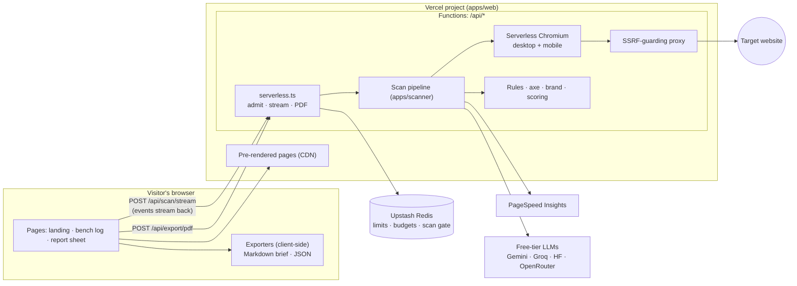

# Architecture

Teardown deploys as **one Vercel project**: Next.js pre-renders the site and serves the scanner as route handlers (Vercel Functions). The same scanner code also runs as a long-lived Fastify server in Docker. Both speak the same API, so the frontend works with either.

## Two deployment modes

| | Vercel (default) | Docker server (alternative) |
|---|---|---|
| Entry | `apps/scanner/src/serverless.ts` via `apps/web/src/app/api/*/route.ts` | `apps/scanner/src/main.ts` (Fastify) |
| Scan request | `POST /api/scan/stream`: one request admits, runs and streams the scan | Same route, plus the queue-based `POST /api/scan` + `GET /api/scan/:id/events` (SSE with replay) |
| Concurrency | Upstash sorted-set gate (`MAX_CONCURRENT_SCANS`), callers wait up to 60 s with `queued` events | In-process FIFO queue with positions |
| Limits and budgets | Upstash Redis (`UpstashRateStore`, `SharedDailyCounters`) | In memory (`MemoryRateStore`, `DailyCounters`) |
| Browser | `@sparticuz/chromium` with `playwright` | Playwright's Chromium (official Playwright image) |
| Performance | PageSpeed Insights, else estimate | PSI, else local Lighthouse (mutex 1), else estimate |
| Report cache | Per warm instance | Per server |
| Caps | 300 s per call: 5 pages in site mode, 270 s scan deadline, 4 MB reports | 15 pages, 6-minute site budget, 10 MB reports |

In-page scripts and PDF fonts are compiled into `src/generated/embedded.ts` (from `inpage/*.js` and the Fontsource packages), so neither bundle reads asset files at runtime.

## Packages

| Path | What it is |
|---|---|
| `packages/core` | The contract. Zod schemas and types for `Report`, findings, brand profile, API errors and events; scoring; colour maths; design tokens; the JSON and Markdown exporters. Pure functions, no I/O. Imported as TypeScript source by both apps, so they can't disagree about the data. Zod-free subpaths (`/scoring`, `/exporters`, `/tokens`, `/color`) keep the web bundle small. |
| `apps/scanner` | Scan pipeline, Playwright capture, rules, axe mapping, brand extraction, PSI/Lighthouse, AI chain, PDF. Two entries: `serverless.ts` (imported by the Next.js route handlers) and `main.ts` (Fastify, bundled with esbuild for Docker). |
| `apps/web` | Next.js App Router: pre-rendered pages plus the `/api` route handlers that call the scanner. |
| `fixtures/pages` | Test pages: `bad.html` (deliberately terrible), `good.html`, `sample/` (the demo shop behind the sample report), `site/` (multi-page site for full-site mode). |

## A scan, step by step

1. **Admission** (`server.ts`, `limits/`): validate and normalise the URL, shape-check it and resolve DNS through the SSRF guard, optional Turnstile, cache lookup (a hit costs nothing), queue capacity, then per-IP / per-domain / global limits. The scan gets an id; the client opens `GET /api/scan/:id/events`.
2. **Queue** (`scan/manager.ts`): FIFO with `MAX_CONCURRENT_SCANS` running; waiting scans receive `queued { position }` updates. Events are buffered per scan for `Last-Event-ID` replay and kept 30 minutes.
3. **Site signals** (`scan/siteSignals.ts`): robots.txt and sitemap through `safeFetch`.
4. **Capture** (`capture/page.ts`): an isolated browser context per pass. Desktop 1440×900: navigate, settle (bounded network idle), scroll for lazy content, wait for fonts, run the in-page collector (`inpage/collect.js`) for page facts and raw brand samples, CDP platform fonts, axe-core, full-page screenshot (≤ 8000 px, resized to 1280 px JPEG). Mobile 390×844 with touch: overflow, tap targets (`inpage/mobile.js`), top-of-page screenshot. A CDP session records the network summary.
5. **Analysis** (`scan/analyze.ts`): rules are pure functions of the captured facts (65 rules, `docs/RULES.md`); axe violations map to findings, skipping concepts our rules cover. Instances are capped at 10 per rule per page with true counts kept.
6. **Full-site mode** (`scan/discover.ts`): sitemap and home-page links, robots.txt rules, normalised URLs, one page per URL template first, `SITE_MAX_PAGES` and a 6-minute budget. Pages run two at a time and stream `page_started` / `page_done`.
7. **Performance** (`perf/`): PSI if a key is set and under its cap, else local Lighthouse on Playwright's Chromium through the guard proxy behind a global mutex, else a documented estimate. Audits below 0.9 become `perf.lh.*` findings unless one of our rules already covers them.
8. **Brand** (`brand/process.ts`): CIEDE2000 clustering of colours weighted by area and text length, role inference, font sources, type-scale fit, spacing grid, radii, shadows, WCAG contrast pairs, `:root` tokens. In site mode the raw samples of all pages are re-clustered together.
9. **Report** (`scan/report.ts`): groups, deterministic scores, stack detection, then the payload cap (screenshots dropped lowest-priority first).
10. **AI** (`ai/`): one call per scan with the top 20 groups (trimmed, delimited, untrusted page text sanitised). Output is validated: unknown ids dropped, ranks renumbered, lengths enforced, off-site links removed. AI changes only order and wording. Failure anywhere returns deterministic advice.
11. **Delivery**: the `report` event, then `done`. The browser keeps the report in memory; Markdown and JSON are generated client-side, the PDF by the scanner.

## Fallback matrix

| Failure | Behaviour | Demonstrated by |
|---|---|---|
| Chromium crashes or can't launch | Retry once, then HTML-only analysis through `safeFetch` + linkedom with `reducedAccuracy: true` and a banner. No screenshots or brand data; performance is estimated. | `test/unit/fallbacks.test.ts` |
| PSI missing, failing or over cap | Local Lighthouse; if that fails, an estimate labelled as such. | `test/unit/perf.test.ts`, `test/integration/scan.test.ts` |
| AI providers fail, rate limit or run out | Circuit breaker skips them; deterministic order and fix text, `ai.status` `fallback` or `skipped`, with a plain note. | `test/unit/ai.test.ts` |
| Daily full-site capacity reached | `CAPACITY` with `suggestMode: single`; the UI offers "Scan this page only". | `test/unit/api.test.ts` |
| Scanner asleep | The landing page pings `/health` (retrying for 90 s) and says "Starting the scanner"; the bench log explains a slow start. | Manual: stop the scanner and load the page |
| Shutdown (SIGTERM) | Stop accepting, cancel queued scans, give running scans 20 s, then abort; close HTTP and the browser. | `test/unit/fallbacks.test.ts` |

## Security

See [SECURITY.md](SECURITY.md) for the threat model and SSRF design.
